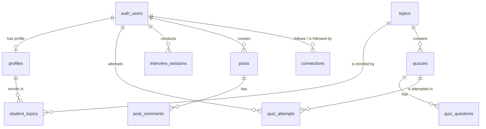

# PlacePro LMS — Architecture Document

## 1. Project Overview

PlacePro LMS is a full-stack, AI-powered Learning Management System targeted at college students and placement candidates. It offers structured course tracks, quiz-based learning, proctored AI voice interviews, live video classes, coding challenges, gamification, a career roadmap generator, and a social feed for peer connections.

### Tech Stack Summary

| Layer | Technology |
|---|---|
| **Frontend** | React 19, TanStack Router (`@tanstack/react-router`) |
| **Styling** | TailwindCSS v4, shadcn/ui (Radix Primitives), Framer Motion, GSAP |
| **Backend / API** | TanStack Start (Nitro runtime via Vite), Node.js |
| **AI-LLM** | Vercel AI SDK (Gemini 1.5 Flash), OpenAI Realtime API (GPT-4o) |
| **Database** | Supabase (PostgreSQL with Row Level Security) |
| **Auth** | Supabase Auth (JWT based) |
| **Hosting** | Vercel (indicated by `vercel.json`), Cloudflare R2 for media |
| **Build** | Vite 8, Bun |
| **Third-party** | MediaPipe (Proctoring face detection) |
| **Live Video** | Custom Peer-to-Peer WebRTC with Supabase Realtime (Broadcast) signaling |


## 2. Folder Structure

```text
c:\Users\Mani\Projects\pixel-perfect-preview
├── .env                    # Environment variables (DO NOT COMMIT)
├── package.json            # Dependencies and scripts (React 19, Vite, Tanstack)
├── vite.config.ts          # Vite bundler configuration & custom invite middleware
├── vercel.json             # Vercel deployment rewrite rules
├── supabase.sql            # Full PostgreSQL database DDL schema and RLS policies
├── README.md               # Project overview
├── api/
│   └── invite.ts           # Standalone invite script/function
├── src/
│   ├── components/         # Reusable React components (shadcn/ui, layout components)
│   ├── hooks/              # Custom React hooks
│   ├── lib/
│   │   ├── supabase.ts     # Supabase client initialization
│   │   ├── store.ts        # LocalStorage + Event-based state for profile and quizzes
│   │   ├── auth-store.ts   # React hook wrapping Supabase auth state changes
│   │   └── r2-client.server.ts # Cloudflare R2 bucket integration
│   ├── routes/             # TanStack file-based routing structure
│   │   ├── api/            # Backend API route handlers (Nitro)
│   │   │   ├── interview.start.ts   # Starts OpenAI realtime session
│   │   │   ├── roadmap.ts           # Gemini 1.5 career roadmap generation
│   │   │   └── onboarding.complete.ts # Completes user profile
│   │   ├── __root.tsx      # Root routing layout & error boundary
│   │   ├── index.tsx       # Landing page (GSAP animated)
│   │   ├── _app.*.tsx      # App views (Dashboard, Quizzes, Interviews, etc)
│   │   └── admin.*.tsx     # Admin dashboard views
│   ├── router.tsx          # TanStack Router initialization
│   ├── routeTree.gen.ts    # Auto-generated routing tree (DO NOT EDIT)
│   └── main.tsx            # React application entry point
└── dist/                   # Production build output
```

## 3. Architecture Diagram

```ascii
+-----------------------+        +---------------------------+        +------------------------+
|                       |  HTTP  |                           |        |                        |
|   Web Browser         +------->+   Backend API (Nitro)     +------->+  Supabase (PostgreSQL) |
|   (React 19, GSAP,    |        |   (/api/* routes)         |        |  Auth + Database + RLS |
|   TanStack Router)    +<-------+                           +<-------+                        |
|                       |        +---+------------------+----+        +------------------------+
|   - LocalStorage      |            |                  |
|   - Context/Hooks     |        HTTP|                  |HTTP
|   - WebRTC            |            v                  v
+-----------+-----------+    +---------------+  +---------------+
            |                | OpenAI API    |  | Gemini API    |
            |WebRTC          | (Realtime)    |  | (AI SDK)      |
            v                +---------------+  +---------------+
   +-----------------------+
   | Peer-to-Peer WebRTC   |
   | (Supabase Realtime    |
   | Signaling)            |
   +-----------------------+
```

## 4. Frontend Architecture

- **Routing:** Handled entirely by `@tanstack/react-router` using file-based routing. The `__root.tsx` defines the main layout and QueryClient provider.
- **State Management:** 
  - **Auth:** Managed via `src/lib/auth-store.ts` using a custom hook `useAuth()` that subscribes to `supabase.auth.onAuthStateChange`.
  - **Client State:** A hybrid approach using `localStorage` coupled with native DOM Event dispatching (`window.dispatchEvent(new Event("profile-updated"))`) to trigger re-renders across components in `src/lib/store.ts`.
  - **Server State:** `@tanstack/react-query` is installed and initialized in the router, intended for async data fetching.
- **Animations:** Heavy use of `framer-motion` for UI interactions and `gsap` (with ScrollTrigger) for complex landing page canvas animations.

### Routing Table Example
| Path | File | Description |
|---|---|---|
| `/` | `index.tsx` | Main GSAP-animated landing page |
| `/login` | `login.tsx` | Authentication login page |
| `/onboarding` | `onboarding.tsx` | Personalized onboarding flow |
| `/dashboard` | `_app.dashboard.tsx` | Main student dashboard |
| `/interview/ai/:sessionId` | `_app.interview.ai.$sessionId.tsx` | Active AI voice interview room |
| `/admin/users` | `admin.users.tsx` | Admin panel for user management |

### Code Snippet: State Management (`src/lib/store.ts`)
```typescript
export function saveProfile(profile: ProfileData) {
  if (typeof window === "undefined") return;
  localStorage.setItem("placepro-profile", JSON.stringify(profile));
  window.dispatchEvent(new Event("profile-updated")); // Manual event bus pattern
}
```

## 5. Backend / API Architecture

- **Framework:** TanStack Start API Routes (running on Nitro).
- **Middleware:** A custom Vite middleware (`api-invite-middleware` in `vite.config.ts`) bypasses standard Nitro routing during development to handle admin user invitations securely via the Supabase Service Role Key.
- **Security & Validation:** Cross-platform input sanitization is implemented for API routes (e.g., chat, posts, stories) using `src/lib/sanitize.ts` to prevent injection attacks.
- **Missing Protections:** 🔴 **No global rate limiting** is evident. 🔴 Some API routes (e.g., `/api/roadmap`) **lack authentication checks** entirely, allowing unauthorized access to paid AI integrations. CORS is manually handled in the Vite dev middleware but relies on hosting config in production.

### Endpoint Table
| Method | Route | Description | Auth Required? |
|---|---|---|---|
| `POST` | `/api/invite` | Invites a user via service role key | Yes (Admin) |
| `POST` | `/api/interview/start` | Fetches OpenAI ephemeral key and creates DB session | Yes |
| `POST` | `/api/onboarding/complete` | Updates user profile and topics | Yes |
| `POST` | `/api/roadmap` | Generates career roadmap via Gemini | **NO (Missing)** |

### Code Snippet: Route Handler (`src/routes/api/interview.start.ts`)
```typescript
const authHeader = request.headers.get("Authorization");
const token = authHeader?.replace("Bearer ", "");
if (!token) return new Response("Unauthorized", { status: 401 });

const { data: { user }, error: authError } = await supabase.auth.getUser(token);
if (authError || !user) return new Response("Unauthorized", { status: 401 });

const response = await fetch("https://api.openai.com/v1/realtime/sessions", {
  method: "POST",
  headers: { Authorization: `Bearer ${openAiKey}`, "Content-Type": "application/json" },
  // ...
});
```

## 6. Database Schema

The application uses PostgreSQL (via Supabase). The full schema is maintained in `supabase.sql`.

### Core Entities
- **Auth & Profiles:** `profiles` (links to `auth.users`), `teachers`, `connections`.
- **LMS Content:** `topics`, `quizzes`, `quiz_questions`, `code_challenges`.
- **User Activity:** `student_topics`, `quiz_attempts`, `code_submissions`, `interview_sessions`.
- **Live Rooms:** `instant_rooms`, `room_participants` (Tracks active rooms and waiting room guests).
- **Gamification:** `xp_transactions`, `badges`, `topic_leaderboards`.
- **Social:** `posts`, `post_reactions`, `post_comments`, `stories`.

### ER Diagram (Mermaid)


## 7. Authentication & Authorization

- **Authentication Method:** Supabase JWT Tokens. Users authenticate on the client, and tokens are stored by the Supabase SDK. 
- **Authorization / Roles:** The system defines three roles: `student`, `teacher`, and `admin` within the `profiles` table.
- **Enforcement Mechanisms:**
  - **Client-side:** `useAuth()` hook determines UI visibility.
  - **Database (RLS):** Strict Row Level Security policies exist in PostgreSQL. E.g., `CREATE POLICY "Manage own or admin" ON quiz_attempts FOR ALL USING (auth.uid() = user_id OR get_user_role() = 'admin');`.
  - **API Level:** Endpoints retrieve the user from the Bearer token via `supabase.auth.getUser(token)`.

## 8. Third-Party Integrations

1. **Supabase:** Core database, authentication, RLS, and **Realtime Broadcast** for WebRTC signaling (live rooms). 
2. **OpenAI (Realtime API):** Used for AI voice interviews. Generates an ephemeral WebRTC token for the client.
3. **Google Gemini (Vercel AI SDK):** Used for generating structured Career Roadmaps (`/api/roadmap`).
4. **Cloudflare R2:** Used for media storage (images/recordings). Configured via AWS S3 SDK compatibility (`@aws-sdk/client-s3`).

### Code Snippet: Gemini Integration (`api/roadmap.ts`)
```typescript
const google = createGoogleGenerativeAI({ apiKey: key });
const { object } = await generateObject({
  model: google("gemini-1.5-flash") as any,
  schema: z.object({ title: z.string(), steps: z.array(...) }),
  prompt: `Generate a detailed step-by-step career roadmap...`
});
```

## 9. Environment Variables

| Variable | Purpose | Scope | Status |
|---|---|---|---|
| `VITE_SUPABASE_URL` | Supabase instance URL | Client/Server | Present |
| `VITE_SUPABASE_ANON_KEY` | Public Supabase anon key | Client/Server | Present |
| `SUPABASE_SERVICE_ROLE_KEY` | Admin access to Supabase | Server Only | Present |
| `GEMINI_API_KEY` | Roadmap generation | Server Only | Present |
| `OPENAI_API_KEY` | Realtime voice interviews | Server Only | Present |
| `R2_ACCOUNT_ID`... | Cloudflare R2 configurations | Server Only | Present |

## 10. Data Flow Walkthroughs

### Flow 1: AI Interview Initialization
1. **User Action:** Clicks "Start AI Interview" on the frontend.
2. **Client:** Calls `POST /api/interview/start` passing their Supabase JWT.
3. **Server:** Verifies the JWT via Supabase. Calls the OpenAI API (`/v1/realtime/sessions`) using the secure server-side `OPENAI_API_KEY`.
4. **Server:** Inserts a new row into `interview_sessions` in Supabase with status `in_progress`.
5. **Response:** Server returns the OpenAI ephemeral `client_secret` and the DB `session_id`.
6. **Client:** Uses the ephemeral key to connect directly to OpenAI via WebRTC for real-time audio.

---

## 11. Code Deep-Dives

This section provides annotated code walkthroughs for the most complex feature areas. Use this as your primary onboarding guide when working on a new feature area.

---

### 11.1 WebRTC Live Rooms (`src/hooks/useWebRTC.ts`)

The entire peer-to-peer video/audio experience for live classes is encapsulated in the `useWebRTC` hook. Understanding this hook is essential before working on `_app.room.$roomCode.tsx`.

#### Architecture: How Two Peers Connect

Supabase Realtime Broadcast is used **only for signaling** (exchanging metadata to set up the connection). After the WebRTC handshake, all audio, video, and in-meeting data flows **directly P2P** and never touches Supabase.

```
Peer A                    Supabase Realtime              Peer B
  |                      (Signaling Only)                   |
  |--- broadcast('join') ---------------------------------> |
  |                                                         |
  | <-- broadcast('offer': SDP) ----------------------- -- |
  |                                                         |
  |--- broadcast('answer': SDP) -----------------------> -- |
  |                                                         |
  | <--> broadcast('ice-candidates-batch') <-----------> -- |
  |                                                         |
  |====== Direct P2P WebRTC Connection Established ======== |
  |   (audio tracks, video tracks, RTCDataChannel)          |
```

#### Key State & Refs

```typescript
// useWebRTC.ts — Key refs explained

// Holds all active RTCPeerConnection objects, keyed by peerId
const peerConnectionsRef = useRef<Record<string, RTCPeerConnection>>({});

// RTCDataChannel references for P2P encrypted chat/polls/hand-raises
const dataChannelsRef = useRef<Record<string, RTCDataChannel>>({});

// ICE candidates are batched (250ms window) before sending to reduce
// Supabase Realtime message volume
const iceCandidatesQueueRef = useRef<Record<string, RTCIceCandidateInit[]>>({});
const iceCandidateTimerRef  = useRef<Record<string, NodeJS.Timeout | null>>({});

// Buffer for ICE candidates that arrive before setRemoteDescription()
// is called — they are queued here and "flushed" after the SDP answer
const candidateBufferRef = useRef<Record<string, RTCIceCandidateInit[]>>({});
```

#### Step-by-Step: Joining a Room

```typescript
// 1. joinRoom() — called when user clicks "Enter Room"
const joinRoom = useCallback(async () => {
  // Step 1: Fetch dynamic TURN server credentials from our own /api/turn endpoint
  const turnRes = await fetch("/api/turn");
  iceServersRef.current = await turnRes.json(); // Stored for RTCPeerConnection config

  // Step 2: Request camera + mic permissions from the browser
  const stream = await initLocalStream();
  // localStreamRef.current = stream (also sets React state for the local video tile)

  // Step 3: Subscribe to the Supabase Realtime channel for this room
  const channel = supabase.channel(`room:${roomCode}`);

  // Step 4: Announce our arrival to all other peers
  channel.subscribe(async (status) => {
    if (status === 'SUBSCRIBED') {
      channel.send({ type: 'broadcast', event: 'join', payload: { from: myPeerId, userName } });
    }
  });
}, []);
```

#### Creating a Peer Connection

```typescript
// createPeerConnection() is called whenever we need to connect to a new peer.
// It is idempotent — calling it with the same peerId returns the existing connection.
const createPeerConnection = (peerId: string, peerName: string) => {
  if (peerConnectionsRef.current[peerId]) return peerConnectionsRef.current[peerId];

  const pc = new RTCPeerConnection({
    iceServers: [
      { urls: 'stun:stun.l.google.com:19302' }, // Public Google STUN for NAT traversal
      ...iceServersRef.current                   // Metered TURN servers (for strict NATs)
    ]
  });

  // Attach local audio/video tracks so the remote peer receives our stream
  localStreamRef.current?.getTracks().forEach(track => pc.addTrack(track, localStreamRef.current!));

  // When remote peer's track arrives, add it to remoteStreams state (renders their video tile)
  pc.ontrack = (event) => {
    setRemoteStreams(prev => {
      const existingStream = prev[peerId]?.stream || new MediaStream();
      existingStream.addTrack(event.track); // Both audio & video tracks arrive via this handler
      return { ...prev, [peerId]: { peerId, userName: peerName, stream: existingStream } };
    });
  };

  // ICE candidates are batched into a 250ms window before broadcasting
  pc.onicecandidate = (event) => {
    if (event.candidate) {
      iceCandidatesQueueRef.current[peerId] ??= [];
      iceCandidatesQueueRef.current[peerId].push(event.candidate);
      // Timer debounces the send — only one Supabase message per 250ms burst
      iceCandidateTimerRef.current[peerId] ??= setTimeout(() => {
        channel.send({ event: 'ice-candidates-batch', payload: { to: peerId, candidates: [...] } });
      }, 250);
    }
  };

  // Auto-ICE restart on connection failure (before removing the peer)
  pc.onconnectionstatechange = () => {
    if (pc.connectionState === 'failed') pc.restartIce();
    if (pc.connectionState === 'disconnected') cleanupPeer(peerId);
  };

  return pc;
};
```

#### In-Meeting Features: P2P DataChannel

Chat messages, polls, and hand-raises are **NOT routed through Supabase**. They travel directly over an `RTCDataChannel`, which is more secure and has lower latency.

```typescript
// All in-meeting events are dispatched with broadcastData()
broadcastData('chat',       { message: { id, senderId, text, timestamp } });
broadcastData('poll_new',   { poll: { id, question, options } });
broadcastData('poll_vote',  { pollId, optionId, voterId });
broadcastData('hand_raise', { peerId: myPeerId.current, isRaised: true });

// handleDataChannelMessage() is the single router for incoming P2P events
const handleDataChannelMessage = (peerId: string, dataStr: string) => {
  const data = JSON.parse(dataStr);
  switch (data.type) {
    case 'chat':       setChatMessages(prev => [...prev, data.message]); break;
    case 'poll_new':   setPolls(prev => [...prev, data.poll]); break;
    case 'poll_vote':  setPolls(prev => prev.map(p => /* update vote counts */)); break;
    case 'hand_raise': setHandRaised(prev => ({ ...prev, [data.peerId]: data.isRaised })); break;
  }
};
```

---

### 11.2 Quiz Engine (`src/routes/_app.quizzes.$quizId.tsx`)

The quiz page is a self-contained state machine. Understanding the state variables is the key to modifying it.

#### State Machine

```
[loading] -> [question N displayed] -> [answer selected] -> [answer revealed]
                                                                    |
                                            [last question?] -------+-------> [finish() -> /results]
                                            [more questions?]       |-> [next question -> index++]
```

#### Key State Variables

```typescript
const [index,      setIndex]      = useState(0);           // Current question index (0-based)
const [selected,   setSelected]   = useState<number | null>(null); // Which option the user clicked
const [revealed,   setRevealed]   = useState(false);       // true = show correct/wrong feedback
const [answers,    setAnswers]    = useState<number[]>([]);// All submitted answers (for results)
const [secondsLeft,setSecondsLeft]= useState(10 * 60);     // Countdown timer (auto-submits at 0)
```

#### Data Fetching Pattern

```typescript
// The quiz route uses a plain useEffect + direct Supabase query (no React Query).
// Two sequential fetches: quiz metadata first, then questions.
useEffect(() => {
  async function loadQuiz() {
    // Fetch quiz title via a Supabase join with the parent topics table
    const { data: quiz } = await supabase
      .from("quizzes")
      .select(`id, title, topics ( title, description )`)
      .eq("id", quizId)
      .single();

    // Fetch all questions for this quiz, ordered by creation time
    const { data: qs } = await supabase
      .from("quiz_questions")
      .select("*")
      .eq("quiz_id", quizId)
      .order("created_at", { ascending: true });

    setQuestions(qs.map(q => ({ ...q, correctIndex: q.correct_index })));
    setLoading(false);
  }
  loadQuiz();
}, [quizId]);
```

#### Finishing a Quiz

```typescript
// Results are passed to the next page via sessionStorage (not URL params or server state).
// This means results are lost on hard refresh of the results page.
const finish = (finalAnswers: number[]) => {
  sessionStorage.setItem(
    `quiz-result-${quizId}`,
    JSON.stringify({ answers: finalAnswers, ts: Date.now() })
  );
  navigate({ to: "/quizzes/$quizId/results", params: { quizId } });
};
```

> ⚠️ **Known Limitation:** Quiz results are stored in `sessionStorage` and are ephemeral. They are not persisted to Supabase (`quiz_attempts`) in the current implementation. This is a feature gap to address.

---

### 11.3 Social Stories (`src/components/social/story-row.tsx`)

Stories are simple but have a visual type system that maps to different ring colors and icons.

#### Story Type → Visual Mapping

```typescript
// story_type from the DB maps to a TailwindCSS ring color class
const storyTypeRing: Record<string, string> = {
  streak:      "ring-streak",       // 🔥 orange/amber
  achievement: "ring-xp-gold",      // ⭐ gold
  media:       "ring-brand",        // 📷 primary brand color
  status:      "ring-success",      // 💬 green
};

// Expiry countdown is computed client-side from the DB `expires_at` timestamp
const msLeft  = new Date(story.expires_at).getTime() - Date.now();
const hrsLeft = Math.max(0, Math.floor(msLeft / 3_600_000)); // "Xh left"
```

#### Component Structure

```
<StoryRow stories={Story[]}>         ← Scrollable horizontal strip
  <Link to="/profile/$username">     ← Each story links to author's profile
    <StoryCard story={story} />      ← Avatar + ring color + type icon + timer
  </Link>
</StoryRow>
```

#### Adding a New Story Type

To add a new type (e.g., `event`):
1. Insert a row in the `stories` table with `story_type = 'event'`.
2. Add an entry to `storyTypeRing` in `story-row.tsx`: `event: "ring-purple-500"`.
3. Add the emoji/icon condition in the icon overlay `<span>` block.

---

### 11.4 Admin Analytics (`src/routes/admin.analytics.tsx`)

The analytics page fetches live KPI counts from Supabase and renders charts using **Recharts**.

#### Current Data Sources

```typescript
// KPIs are fetched directly via Supabase count queries.
// This pattern uses { count: "exact", head: true } to get only the row count
// without fetching actual data — very efficient for large tables.
const { count: usersCount }       = await supabase.from("profiles").select("*", { count: "exact", head: true });
const { count: enrollmentsCount } = await supabase.from("student_topics").select("*", { count: "exact", head: true });

setKpis([
  { label: "Total Users",       value: usersCount.toString() },
  { label: "Total Enrollments", value: enrollmentsCount.toString() },
  { label: "Completion Rate",   value: "85%" }, // ← ⚠️ HARDCODED, not from DB
]);
```

> ⚠️ **Known Issue:** The `Completion Rate` KPI and the time-series chart data (`series`) are currently hardcoded placeholder values. The `period` selector (`7d`, `30d`, `90d`) re-fires the `useEffect` but the data doesn't actually change. This needs to be connected to a real Supabase query filtering by `created_at`.

#### Chart Components Used

```tsx
// Line chart for time-series data (active learners trend)
<LineChart data={series}>
  <Line type="monotone" dataKey="learners" stroke="var(--brand)" strokeWidth={2} dot={false} />
  <XAxis dataKey="day" />
  <Tooltip />
</LineChart>

// Bar chart for enrollments per day
<BarChart data={series}>
  <Bar dataKey="enrollments" fill="var(--brand)" radius={[4, 4, 0, 0]} />
</BarChart>
```

#### How to Add a New KPI Card

1. Add a new Supabase count query in the `loadData()` function.
2. Push a new `{ label, value }` object to the `kpis` array via `setKpis`.
3. The KPI cards are rendered from the `kpis` array automatically — no UI changes needed.

---

## 12. Deployment Architecture

- **Hosting:** The application is designed to be hosted on Vercel or Cloudflare. The `vercel.json` rewrite rules route `/api/*` to the Nitro backend and everything else to `index.html` (SPA fallback).
- **Media Storage:** Cloudflare R2 is explicitly configured for robust media storage, reducing egress costs compared to standard Vercel blob storage.
- **Database:** Supabase acts as a standalone external database provider.

## 13. Known Issues / TODOs

### 🔴 Critical
- **Unauthenticated API Route:** The `/api/roadmap.ts` endpoint lacks Supabase token verification. Anyone can POST to this endpoint and consume the server's `GEMINI_API_KEY` quota.

### 🟡 Important
- **State Management Anti-Pattern:** Global state (`src/lib/store.ts`) relies on `window.dispatchEvent(new Event(...))`. This can lead to race conditions and brittle react reactivity. Since `@tanstack/react-query` is installed, state syncing should ideally be migrated to query mutations and invalidations.
- **Missing Global Rate Limiting:** No rate limiting is configured in Nitro, making AI endpoints vulnerable to abuse.
- **Quiz Results Not Persisted:** `quiz_attempts` table exists in the schema but quiz results are currently only saved to `sessionStorage`. They should be written to Supabase after quiz completion.
- **Analytics Charts Hardcoded:** The time-series chart data in `admin.analytics.tsx` uses static placeholder values. The period filter (`7d/30d/90d`) does not affect the data.

### 🟢 Feature Stubs
- The database schema introduces an `arena_mode` for CTFs (`topic_leaderboards`, `flag_submitted`), which appear to be recent structural additions likely still in active development on the frontend (`_app.arena.tsx`).

---
*Document Generation Date: 2026-07-22*
*Codebase Version/Branch: Local Development Workspace*
