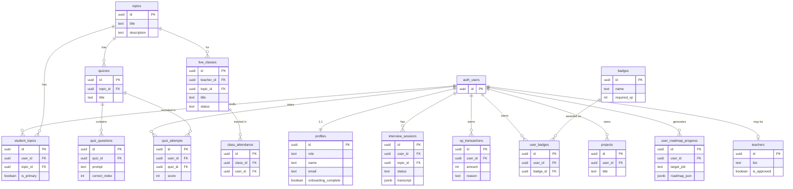

# PlacePro LMS — Architecture Document

> Generated: 2026-07-11 · Branch: main (PlacePro-connected)

---

## 1. Project Overview

**PlacePro LMS** is a full-stack AI-powered Learning Management System targeting college students and placement candidates. Its purpose is to provide an all-in-one platform for placement preparation: structured course tracks, quiz-based learning, AI voice interviews with real-time proctoring, live video classes, coding challenges, gamification (XP / streaks / leaderboard), a career roadmap generator, and a job board. It is operated by three roles: **student**, **teacher**, and **admin**.

### Core Features (verified from routes and schema)

- **Quizzes** — timed multiple-choice quizzes with instant feedback and score persistence
- **AI Mock Interviews** — WebRTC + OpenAI Realtime API voice sessions, proctored by MediaPipe face detection
- **Live Classes** — Daily.co video rooms scheduled by teachers, embedded in an iframe
- **Career Roadmap** — AI-generated step-by-step roadmap via Gemini 1.5 Flash
- **Social Feed & Connections** — Student feed, posts, comments, reactions, and a connection/following graph
- **Instant Video Rooms** — Ephemeral WebRTC rooms for quick collaborative study sessions
- **CTF & Practice Arena** — Code challenges and Capture the Flag (CTF) hacker rooms
- **Interview Monitoring** — Admin dashboard for live session monitoring and automated flagging
- **Leaderboard** — XP-based rankings (currently seeded from mock data)
- **Dashboard** — Course enrollment, daily missions, and quiz history
- **Admin Panel** — User management, teacher approval, analytics (charts powered by Recharts)

### Tech Stack Summary

| Layer                    | Technology                                                                                    | Version / Details                |
| ------------------------ | --------------------------------------------------------------------------------------------- | -------------------------------- |
| **Frontend Framework**   | React                                                                                         | 19.2                             |
| **Full-Stack Framework** | TanStack Start (SSR)                                                                          | ^1.168.26                        |
| **Routing**              | TanStack Router (file-based)                                                                  | ^1.170.16                        |
| **Styling**              | TailwindCSS v4                                                                                | ^4.2.1 (via `@tailwindcss/vite`) |
| **UI Components**        | shadcn/ui (Radix UI primitives)                                                               | ~49 components                   |
| **State Management**     | TanStack Query + `localStorage` + custom `window` events                                      | —                                |
| **Backend Runtime**      | Nitro (Cloudflare Workers target via `@PlacePro.dev/vite-tanstack-config`)                     | ^3.0.260603-beta                 |
| **AI — Text/Object**     | Vercel AI SDK (`ai`) + Google Gemini 1.5 Flash via `@ai-sdk/google`                           | ai@6.0.209                       |
| **AI — Voice/RT**        | OpenAI Realtime API (WebRTC) + `gpt-4o-realtime-preview-2024-12-17`                           | Direct REST                      |
| **AI — Feedback**        | PlacePro AI Gateway (`https://ai.gateway.PlacePro.dev/v1`) with `google/gemini-3-flash-preview` | Custom OpenAI-compat             |
| **AI — Proctoring**      | MediaPipe Tasks Vision (`@mediapipe/tasks-vision`) — FaceLandmarker                           | ^0.10.35                         |
| **Database**             | Supabase (PostgreSQL + RLS)                                                                   | ^2.108.2                         |
| **Auth**                 | Supabase Auth (email/password + Google OAuth)                                                 | —                                |
| **Hosting**              | PlacePro Cloud (Cloudflare Workers / Nitro)                                                    | —                                |
| **Build Tool**           | Vite 8 + `@PlacePro.dev/vite-tanstack-config`                                                  | ^8.0.16                          |
| **Package Manager**      | Bun (+ npm lock for compat)                                                                   | —                                |
| **Third-Party Video**    | Daily.co                                                                                      | REST API                         |
| **Fonts**                | Inter, JetBrains Mono, Plus Jakarta Sans (via `@fontsource`)                                  | —                                |
| **Charts**               | Recharts                                                                                      | ^2.15.0                          |
| **Animations**           | Framer Motion / Motion                                                                        | ^12.42.0                         |
| **Streaming Markdown**   | streamdown + plugins (CJK, code, math, mermaid)                                               | ^2.5.0                           |

---

## 2. Folder Structure

```
pixel-perfect-preview/
│
├── .env                          ← Runtime secrets (NEVER commit — has live Supabase keys)
├── .gitignore
├── .prettierrc / .prettierignore ← Code formatting config
├── AGENTS.md                     ← PlacePro AI agent rules (do not rewrite pushed history)
├── architecture_document.md      ← THIS FILE
├── bun.lock                      ← Bun lockfile (primary package manager)
├── bunfig.toml                   ← Bun configuration
├── components.json               ← shadcn/ui component config (paths, style, baseColor)
├── eslint.config.js              ← ESLint 9 flat config (react-hooks, prettier, ts-eslint)
├── index.html                    ← Vite SPA shell (large; contains inlined error page HTML)
├── package.json                  ← NPM manifest — all deps and scripts
├── package-lock.json             ← NPM lockfile (kept for CI compat alongside bun.lock)
├── supabase.sql                  ← Full database DDL + RLS policies (source of truth for schema)
├── tsconfig.json                 ← TypeScript config (strict, path alias @/ → src/)
├── vite.config.ts                ← Vite config — delegates to @PlacePro.dev/vite-tanstack-config
│
├── public/                       ← Static assets served at root
│
├── screenshots/                  ← UI screenshots (not shipped)
│
├── .output/                      ← Nitro build output (DO NOT EDIT — auto-generated)
├── .tanstack/                    ← TanStack Router type cache (DO NOT EDIT — auto-generated)
├── .wrangler/                    ← Wrangler / Cloudflare Workers local state (DO NOT EDIT)
├── .PlacePro/                     ← PlacePro platform metadata (DO NOT EDIT)
├── node_modules/                 ← Installed packages (DO NOT EDIT)
│
└── src/
    ├── styles.css                ← Global CSS: Tailwind v4 directives, CSS custom properties,
    │                               semantic color tokens (brand, streak, xp-gold, card tints)
    ├── router.tsx                ← TanStack Router instance creation + QueryClient injection
    ├── start.ts                  ← TanStack Start entry point; registers errorMiddleware
    ├── server.ts                 ← Nitro server entry (SSR error normalization wrapper)
    ├── routeTree.gen.ts          ← AUTO-GENERATED by TanStack Router (DO NOT EDIT)
    │
    ├── routes/
    │   ├── README.md             ← File-routing conventions doc
    │   ├── __root.tsx            ← Root layout: QueryClientProvider, <html> shell, SEO meta
    │   ├── index.tsx             ← Public landing page ("/") — hero, features, project showcase
    │   ├── login.tsx             ← Email/password + Google OAuth login
    │   ├── signup.tsx            ← Registration with role selector (student | teacher)
    │   ├── onboarding.tsx        ← Student topic-selection wizard (gated: students only, incomplete onboarding)
    │   ├── oauth.consent.tsx     ← OAuth consent screen stub (simulated — not a real OAuth server)
    │   │
    │   ├── _app.tsx              ← Authenticated layout guard: checks Supabase session, renders AppSidebar
    │   ├── _app.dashboard.tsx    ← Student dashboard — enrolled courses, missions, quiz history
    │   ├── _app.quizzes.tsx      ← Quizzes layout (passthrough Outlet)
    │   ├── _app.quizzes.index.tsx← Quiz listing page
    │   ├── _app.quizzes.$quizId.tsx  ← Timed quiz engine (questions from mock-data)
    │   ├── _app.quizzes.$quizId.results.tsx ← Quiz results with score breakdown
    │   ├── _app.interview.tsx    ← Interview layout (passthrough Outlet)
    │   ├── _app.interview.index.tsx  ← Interview mode picker (AI vs Live)
    │   ├── _app.interview.ai.$sessionId.tsx ← WebRTC + OpenAI Realtime voice interview + MediaPipe proctoring
    │   ├── _app.interview.manual.$sessionId.tsx ← Manual/live interview stub
    │   ├── _app.interview.$sessionId.feedback.tsx ← AI-generated feedback from transcript (PlacePro gateway)
    │   ├── _app.live.index.tsx   ← Live classes list; teachers can schedule classes
    │   ├── _app.live.$classId.tsx← Daily.co iframe embed + attendance logging
    │   ├── _app.code.tsx         ← Code challenges STUB (PageStub component)
    │   ├── _app.code.$challengeId.tsx ← Individual challenge STUB
    │   ├── _app.jobs.tsx         ← Jobs board STUB
    │   ├── _app.roadmap.tsx      ← AI career roadmap generator (Gemini via /api/roadmap)
    │   ├── _app.resume.tsx       ← Resume builder STUB
    │   ├── _app.leaderboard.tsx  ← XP leaderboard (mock data)
    │   ├── _app.profile.tsx      ← User profile (localStorage-backed edits)
    │   │
    │   ├── admin.tsx             ← Admin layout guard: checks session + role = 'admin'
    │   ├── admin.index.tsx       ← Admin dashboard (KPI cards, Recharts bar chart — mock data)
    │   ├── admin.analytics.tsx   ← Analytics page
    │   ├── admin.users.tsx       ← User management (mock data from lib/mock-data.ts)
    │   ├── admin.teachers.tsx    ← Teacher approval workflow (real Supabase queries)
    │   ├── admin.projects.tsx    ← Projects listing
    │   ├── admin.quizzes.tsx     ← Quiz management STUB
    │   ├── admin.topics.tsx      ← Topic management STUB
    │   │
    │   └── api/                  ← Server-only API handlers (TanStack Start server: { handlers })
    │       ├── chat.ts           ← POST /api/chat — streaming chat via Gemini 1.5 Flash
    │       ├── classes.create.ts ← POST /api/classes/create — create Daily.co room + DB record
    │       ├── courses.enroll.ts ← POST /api/courses/enroll — upsert student_topics
    │       ├── courses.enrolled.ts ← GET /api/courses/enrolled — list enrolled topics
    │       ├── interview.start.ts← POST /api/interview/start — get OpenAI ephemeral key + create session
    │       ├── onboarding.complete.ts ← POST /api/onboarding/complete — set topics + mark onboarding done
    │       └── roadmap.ts        ← POST /api/roadmap — generate career roadmap via Gemini
    │
    ├── components/
    │   ├── app-sidebar.tsx       ← Left nav for authenticated users; shows role-conditional "Admin" link
    │   ├── admin-sidebar.tsx     ← Left nav for admin section
    │   ├── top-bar.tsx           ← Page-level header with title + mobile hamburger
    │   ├── auth-background.tsx   ← Decorative SVG/gradient background for auth pages
    │   ├── page-stub.tsx         ← Placeholder for unbuilt routes (Code, Jobs, Resume)
    │   ├── streak-calendar.tsx   ← Heatmap-style calendar for study streaks
    │   └── ai-elements/
    │       ├── conversation.tsx  ← Chat conversation container
    │       ├── message.tsx       ← Individual message bubble with markdown rendering
    │       ├── prompt-input.tsx  ← Rich chat input (40 KB — largest component in the repo)
    │       └── shimmer.tsx       ← Loading shimmer animation for AI responses
    │   └── ui/                   ← 49 shadcn/ui components (accordion → tooltip)
    │
    ├── hooks/
    │   └── use-mobile.tsx        ← useIsMobile() — detects <=768px breakpoint
    │
    └── lib/
        ├── supabase.ts           ← Supabase client (anon key); TypeScript row types
        ├── auth-store.ts         ← useAuth() hook + useProjects() hook
        │                           *** useAuth() is MOCKED — always returns admin session ***
        ├── store.ts              ← localStorage helpers: profile, quiz history; Supabase write-through
        ├── mock-data.ts          ← All hardcoded/seeded data (quiz questions, leaderboard, roles)
        ├── ai-gateway.server.ts  ← AI Gateway provider factory (OpenAI-compat)
        ├── interview-feedback.functions.ts ← TanStack Start server function for feedback generation
        ├── error-capture.ts      ← Global error capture utility (for SSR error normalization)
        ├── error-page.ts         ← Static HTML error page generator (no external deps)
        ├── error-reporting.ts    ← Sends errors to error tracker
        └── utils.ts              ← cn() classname merger (clsx + tailwind-merge)
```

---

## 3. Architecture Diagram

```
+---------------------------------------------------------------------+
|                         BROWSER (Client)                            |
|                                                                     |
|  +-------------------------------------------------------------+   |
|  |  TanStack Router (file-based, type-safe)                    |   |
|  |  React 19 + TailwindCSS v4 + shadcn/ui + Framer Motion      |   |
|  |                                                             |   |
|  |  +-------------+  +------------+  +----------------------+ |   |
|  |  | Quiz Engine |  | AI Chat UI |  | WebRTC Interview UI  | |   |
|  |  | (mock-data) |  |(streamdown)|  | (MediaPipe proctor)  | |   |
|  |  +-------------+  +------------+  +----------------------+ |   |
|  +------------+------------------+------------------+-----------+  |
|               |                  |                  |              |
|  Supabase JS  |             fetch|/api/*       WebRTC| signaling   |
+---------------+------------------+------------------+------------- +
                |                  |                  |
                v                  v                  v
  +------------------+  +------------------------------------------+
  |  SUPABASE CLOUD  |  |  NITRO SERVER (Cloudflare Workers)        |
  |  (PostgreSQL)    |  |  TanStack Start SSR + API routes          |
  |                  |  |                                           |
  |  - auth.users    |  |  POST /api/chat        -> Gemini 1.5 Flash|
  |  - profiles      |  |  POST /api/roadmap     -> Gemini 1.5 Flash|
  |  - topics        |  |  POST /api/interview/  -> OpenAI Realtime |
  |  - quizzes       |  |    start               -> Supabase (DB)   |
  |  - interview_    |  |  POST /api/classes/    -> Daily.co API    |
  |    sessions      |  |    create              -> Supabase (DB)   |
  |  - live_classes  |  |  GET/POST /api/courses -> Supabase (DB)   |
  |  - (+ 17 more)   |  |  POST /api/onboarding  -> Supabase (DB)   |
  |                  |  |                                           |
  |  RLS policies    |  |  TanStack Server Fn:                      |
  |  on all tables   |  |  generateInterviewFeedback                |
  |                  |  |   -> PlacePro AI Gateway                   |
  +------------------+  |   -> google/gemini-3-flash-preview        |
                         +------------------------------------------+
                                         |
                                         v
               +--------------------------------------------+
               |            EXTERNAL APIs                    |
               |                                            |
               |  - Google Gemini 1.5 Flash (text/stream)   |
               |    via @ai-sdk/google                       |
               |                                            |
               |  - OpenAI Realtime API (WebRTC/voice)       |
               |    api.openai.com/v1/realtime               |
               |    api.openai.com/v1/realtime/sessions      |
               |                                            |
               |  - PlacePro AI Gateway (OpenAI-compat)       |
               |    ai.gateway.PlacePro.dev/v1                |
               |    -> gemini-3-flash-preview (feedback)     |
               |                                            |
               |  - Daily.co (video rooms)                   |
               |    api.daily.co/v1/rooms                    |
               |                                            |
               |  - MediaPipe CDN (WASM models)              |
               |    cdn.jsdelivr.net/npm/@mediapipe/...      |
               |    storage.googleapis.com/mediapipe-models/ |
               +--------------------------------------------+
```

---

## 4. Frontend Architecture

### Key Libraries and Their Roles

| Library                       | Purpose                                                                                                          |
| ----------------------------- | ---------------------------------------------------------------------------------------------------------------- |
| `@tanstack/react-router`      | File-based routing with type-safe params, search, and `beforeLoad` guards                                        |
| `@tanstack/react-query`       | Server-state caching (configured in `__root.tsx`); used minimally — most data is fetched in `useEffect` directly |
| `@tanstack/react-start`       | Full-stack framework: SSR, server functions (`createServerFn`), API route handlers                               |
| `tailwindcss` v4              | Utility-first styling; CSS variables drive the design system in `styles.css`                                     |
| `framer-motion` / `motion`    | Page/component animations (sidebar transitions, hover effects)                                                   |
| `@radix-ui/*` (via shadcn/ui) | Accessible headless UI primitives (49 components in `src/components/ui/`)                                        |
| `lucide-react`                | Icon set                                                                                                         |
| `recharts`                    | Bar/chart rendering in admin dashboard                                                                           |
| `react-hook-form` + `zod`     | Form state and schema validation (used in some admin forms)                                                      |
| `streamdown` + plugins        | Real-time streaming markdown renderer for AI chat messages                                                       |
| `@mediapipe/tasks-vision`     | Client-side face detection for interview proctoring                                                              |
| `sonner`                      | Toast notification system                                                                                        |
| `@ai-sdk/react`               | `useChat` hook for AI chat UI state                                                                              |
| `date-fns`                    | Date formatting (streak calendar, timestamps)                                                                    |
| `nanoid`                      | ID generation                                                                                                    |

### Full Routing Table

| Path                             | File                                            | Description                                 | Auth Required                         |
| -------------------------------- | ----------------------------------------------- | ------------------------------------------- | ------------------------------------- |

| `/`                              | `routes/index.tsx`                              | Public marketing landing page               | No                                    |
| `/login`                         | `routes/login.tsx`                              | Email/password + Google OAuth login         | No                                    |
| `/signup`                        | `routes/signup.tsx`                             | Registration with role selector             | No                                    |
| `/onboarding`                    | `routes/onboarding.tsx`                         | Topic selection wizard                      | Yes (students, onboarding incomplete) |
| `/oauth/consent`                 | `routes/oauth.consent.tsx`                      | OAuth consent UI (stub — simulated)         | No                                    |
| `/dashboard`                     | `routes/_app.dashboard.tsx`                     | Student dashboard — enrolled courses, missions, quiz history    | Yes (`_app` guard)                    |
| `/feed`                          | `routes/_app.feed.index.tsx`                    | Social feed, posts, suggestions                             | Yes                                   |
| `/quizzes`                       | `routes/_app.quizzes.index.tsx`                 | Quiz topic listing                                          | Yes                                   |
| `/quizzes/:quizId`               | `routes/_app.quizzes.$quizId.tsx`               | Timed quiz engine                                           | Yes                                   |
| `/quizzes/:quizId/results`       | `routes/_app.quizzes.$quizId.results.tsx`       | Score summary                                               | Yes                                   |
| `/interview`                     | `routes/_app.interview.index.tsx`               | AI vs Live mode picker                                      | Yes                                   |
| `/interview/ai/:sessionId`       | `routes/_app.interview.ai.$sessionId.tsx`       | Live WebRTC + proctoring session                            | Yes                                   |
| `/interview/manual/:sessionId`   | `routes/_app.interview.manual.$sessionId.tsx`   | Manual interview stub                                       | Yes                                   |
| `/interview/:sessionId/feedback` | `routes/_app.interview.$sessionId.feedback.tsx` | AI-generated post-interview feedback                        | Yes                                   |
| `/rooms`                         | `routes/_app.rooms.tsx`                         | Instant collaborative video room dashboard                  | Yes                                   |
| `/rooms/:roomCode`               | `routes/_app.rooms.$roomCode.tsx`               | Active instant video room UI                                | Yes                                   |
| `/arena`                         | `routes/_app.arena.tsx`                         | Practice arena hub (Code Ranker & CTF)                      | Yes                                   |
| `/arena/:topicId`                | `routes/_app.arena.$topicId.tsx`                | Topic challenge list and leaderboard                        | Yes                                   |
| `/arena/:topicId/:challengeId`   | `routes/_app.arena.$topicId.$challengeId.tsx`   | Live code editor and flag submission                        | Yes                                   |
| `/live`                          | `routes/_app.live.index.tsx`                    | Live class listing; teacher scheduling form                 | Yes                                   |
| `/live/:classId`                 | `routes/_app.live.$classId.tsx`                 | Daily.co video room embed                                   | Yes                                   |
| `/code`                          | `routes/_app.code.tsx`                          | Code challenges **STUB**                                    | Yes                                   |
| `/code/:challengeId`             | `routes/_app.code.$challengeId.tsx`             | Individual challenge **STUB**                               | Yes                                   |
| `/jobs`                          | `routes/_app.jobs.tsx`                          | Jobs board **STUB**                                         | Yes                                   |
| `/roadmap`                       | `routes/_app.roadmap.tsx`                       | AI career roadmap generator                                 | Yes                                   |
| `/resume`                        | `routes/_app.resume.tsx`                        | Resume builder **STUB**                                     | Yes                                   |
| `/leaderboard`                   | `routes/_app.leaderboard.tsx`                   | XP leaderboard                                              | Yes                                   |
| `/profile`                       | `routes/_app.profile.tsx`                       | User profile editor                                         | Yes                                   |
| `/admin`                         | `routes/admin.index.tsx`                        | Admin KPI dashboard                                         | Yes + admin role                      |
| `/admin/users`                   | `routes/admin.users.tsx`                        | User list (mock data)                                       | Yes + admin role                      |
| `/admin/teachers`                | `routes/admin.teachers.tsx`                     | Teacher approval (real Supabase)                            | Yes + admin role                      |
| `/admin/interviews`              | `routes/admin.interviews.tsx`                   | Live interview monitoring and flagging dashboard            | Yes + admin role                      |
| `/admin/analytics`               | `routes/admin.analytics.tsx`                    | Analytics page                                              | Yes + admin role                      |
| `/admin/projects`                | `routes/admin.projects.tsx`                     | Projects listing                                            | Yes + admin role                      |
| `/admin/quizzes`                 | `routes/admin.quizzes.tsx`                      | Quiz management **STUB**                                    | Yes + admin role                      |
| `/admin/topics`                  | `routes/admin.topics.tsx`                       | Topic management **STUB**                                   | Yes + admin role                      |

**API Routes (server-side only):**

| Method | Path                       | File                                |
| ------ | -------------------------- | ----------------------------------- |
| POST   | `/api/chat`                | `routes/api/chat.ts`                |
| POST   | `/api/roadmap`             | `routes/api/roadmap.ts`             |
| POST   | `/api/interview/start`     | `routes/api/interview.start.ts`     |
| POST   | `/api/classes/create`      | `routes/api/classes.create.ts`      |
| POST   | `/api/courses/enroll`      | `routes/api/courses.enroll.ts`      |
| GET    | `/api/courses/enrolled`    | `routes/api/courses.enrolled.ts`    |
| POST   | `/api/onboarding/complete` | `routes/api/onboarding.complete.ts` |

### State Management Approach

The app uses **three distinct layers** with no unified state manager:

| Layer                       | Mechanism                                                                                                                     | What it stores                                                                        |
| --------------------------- | ----------------------------------------------------------------------------------------------------------------------------- | ------------------------------------------------------------------------------------- |
| **Server state**            | TanStack Query (configured in `__root.tsx`) + direct `useEffect` Supabase calls                                               | Enrolled courses, live classes, teacher lists, topics                                 |
| **Local persistence**       | `localStorage` via helpers in `lib/store.ts`                                                                                  | User profile (`placepro-profile`), quiz attempt history (`placepro-quizzes`)          |
| **Session storage**         | `sessionStorage`                                                                                                              | Quiz results (`quiz-result-{quizId}`), interview transcript (`interview-{sessionId}`) |
| **In-memory / React state** | `useState` inside route components                                                                                            | UI state, form values, loading/error flags                                            |
| **Cross-tab sync**          | `window.dispatchEvent` + `window.addEventListener` with custom events (`profile-updated`, `quiz-updated`, `projects-changed`) | Profile updates, quiz saves, project inserts                                          |

**Key design note:** `useProfile()` reads from `localStorage` only — it does **not** read from `auth.users` or `profiles` in Supabase. Profile edits in the UI go to `localStorage`, not the database. This is a significant data inconsistency (see Section 12).

### Key Reusable Components

| Component        | File                                      | Purpose                                                                                |
| ---------------- | ----------------------------------------- | -------------------------------------------------------------------------------------- |
| `AppSidebar`     | `components/app-sidebar.tsx`              | Authenticated nav — shows enrolled courses dynamically; admin link conditional on role |
| `AdminSidebar`   | `components/admin-sidebar.tsx`            | Admin-specific nav                                                                     |
| `TopBar`         | `components/top-bar.tsx`                  | Per-page header with title and mobile toggle                                           |
| `PageStub`       | `components/page-stub.tsx`                | Placeholder UI for unbuilt routes (Code, Jobs, Resume) with bullet points              |
| `StreakCalendar` | `components/streak-calendar.tsx`          | Activity heatmap calendar                                                              |
| `AuthBackground` | `components/auth-background.tsx`          | Decorative background for login/signup pages                                           |
| `Conversation`   | `components/ai-elements/conversation.tsx` | Chat history container                                                                 |
| `Message`        | `components/ai-elements/message.tsx`      | Message bubble with streamdown markdown rendering                                      |
| `PromptInput`    | `components/ai-elements/prompt-input.tsx` | Full-featured AI chat input (40 KB — includes file upload, voice, formatting toolbar)  |
| `Shimmer`        | `components/ai-elements/shimmer.tsx`      | Skeleton shimmer for streaming AI responses                                            |

### Real Code Snippets

**Snippet 1: Route guard in `_app.tsx` (`src/routes/_app.tsx`)**

```tsx
export const Route = createFileRoute("/_app")({
  beforeLoad: async () => {
    const {
      data: { session },
    } = await supabase.auth.getSession();
    if (!session) {
      throw redirect({ to: "/login" });
    }
  },
  component: AppLayout,
});
```

**Snippet 2: `useAuth()` mock override in `lib/auth-store.ts` — CRITICAL BUG**

```ts
export function useAuth() {
  const [session, setSession] = useState<UserSession | null>(null);
  const [isLoading, setIsLoading] = useState(true);

  useEffect(() => {
    // TEMPORARY: Mock session to bypass Supabase outage
    setSession({
      id: "mock-admin-123",
      role: "admin",
      name: "Mock Admin User",
      email: "admin@placepro.local",
      onboarding_complete: true,
    });
    setIsLoading(false);
  }, []);
  // ...
}
```

> **This means every component consuming `useAuth()` (AppSidebar, live classes, live room, roadmap) sees a hardcoded admin identity regardless of the real session.**

**Snippet 3: Cross-tab profile sync in `lib/store.ts`**

```ts
export function saveProfile(profile: ProfileData) {
  if (typeof window === "undefined") return;
  localStorage.setItem("placepro-profile", JSON.stringify(profile));
  window.dispatchEvent(new Event("profile-updated"));
}

export function useProfile() {
  const [profile, setProfile] = useState<ProfileData>(getProfile);
  useEffect(() => {
    const handleUpdate = () => setProfile(getProfile());
    window.addEventListener("profile-updated", handleUpdate);
    return () => window.removeEventListener("profile-updated", handleUpdate);
  }, []);
  return { profile, saveProfile };
}
```

---

## 5. Backend / API Architecture

### Framework and Runtime

- **Framework:** TanStack Start (built on Nitro)
- **Runtime target:** Cloudflare Workers (configured by `@PlacePro.dev/vite-tanstack-config`; nitro preset = `cloudflare`)
- **Entry point:** `src/server.ts` → `src/start.ts` → TanStack Start SSR handler

API routes live in `src/routes/api/` and are declared as TanStack Router file routes with a `server: { handlers: { METHOD: ... } }` block — they are **never bundled into the client**.

### Full API Endpoint Table

| Method | Route                      | File                         | Description                                                             | Auth Required             |
| ------ | -------------------------- | ---------------------------- | ----------------------------------------------------------------------- | ------------------------- |
| POST   | `/api/chat`                | `api/chat.ts`                | Streams a chat response from Gemini 1.5 Flash                           | No token check            |
| POST   | `/api/roadmap`             | `api/roadmap.ts`             | Generates JSON career roadmap via Gemini 1.5 Flash                      | No token check            |
| POST   | `/api/interview/start`     | `api/interview.start.ts`     | Creates OpenAI realtime session + inserts `interview_sessions` row      | Bearer token              |
| POST   | `/api/classes/create`      | `api/classes.create.ts`      | Creates Daily.co room + inserts `live_classes` row; checks teacher role | Bearer token + role check |
| POST   | `/api/courses/enroll`      | `api/courses.enroll.ts`      | Upserts `student_topics` row                                            | Bearer token              |
| GET    | `/api/courses/enrolled`    | `api/courses.enrolled.ts`    | Returns enrolled topics for the authed user                             | Bearer token              |
| POST   | `/api/onboarding/complete` | `api/onboarding.complete.ts` | Inserts `student_topics` rows + sets `onboarding_complete = true`       | Bearer token              |

Additionally, there is one **TanStack Server Function** (RPC, not REST):

| Function                    | File                                  | Description                                                        | Auth             |
| --------------------------- | ------------------------------------- | ------------------------------------------------------------------ | ---------------- |
| `generateInterviewFeedback` | `lib/interview-feedback.functions.ts` | Generates scored feedback from a transcript via PlacePro AI Gateway | No session check |

### Middleware

**Present:**

- `errorMiddleware` in `src/start.ts` — catches unhandled server-side throws, renders a static HTML error page
- SSR error normalization in `src/server.ts` — intercepts h3's `{"unhandled":true}` JSON 500 responses

**Missing — Security Gaps:**

- **No CORS headers** — any origin can POST to `/api/chat` or `/api/roadmap`
- **No rate limiting** — all AI endpoints are unauthenticated and unbounded (cost exposure)
- **No request size limits** declared in middleware
- **No input sanitization middleware** — all validation is manual per-handler

### Real Route Handler Code Snippet

**`/api/interview/start` (`src/routes/api/interview.start.ts`)**

```ts
POST: async ({ request }) => {
  const authHeader = request.headers.get("Authorization");
  const token = authHeader?.replace("Bearer ", "");
  if (!token) return new Response("Unauthorized", { status: 401 });

  const {
    data: { user },
    error: authError,
  } = await supabase.auth.getUser(token);
  if (authError || !user) return new Response("Unauthorized", { status: 401 });

  const { topic_id } = await request.json();

  const openAiKey = process.env.OPENAI_API_KEY;
  if (!openAiKey) return new Response("Missing OPENAI_API_KEY", { status: 500 });

  const response = await fetch("https://api.openai.com/v1/realtime/sessions", {
    method: "POST",
    headers: { Authorization: `Bearer ${openAiKey}`, "Content-Type": "application/json" },
    body: JSON.stringify({
      model: "gpt-4o-realtime-preview-2024-12-17",
      voice: "alloy",
      instructions: "You are a professional technical interviewer for PlacePro LMS...",
      modalities: ["audio", "text"],
      input_audio_transcription: { model: "whisper-1" },
    }),
  });

  const sessionData = await response.json();
  const ephemeralKey = sessionData.client_secret.value;

  const { data: interview } = await supabase
    .from("interview_sessions")
    .insert({
      user_id: user.id,
      topic_id: topic_id || null,
      status: "in_progress",
    })
    .select()
    .single();

  return new Response(JSON.stringify({ client_secret: ephemeralKey, session_id: interview.id }), {
    headers: { "Content-Type": "application/json" },
  });
};
```

---

## 6. Database Schema

> Source of truth: `supabase.sql` (402 lines)

### All Tables

#### `profiles` — User identity and roles

| Column                | Type        | Constraints                                        |
| --------------------- | ----------- | -------------------------------------------------- |
| `id`                  | UUID        | PK, FK → `auth.users(id)` ON DELETE CASCADE        |
| `role`                | TEXT        | NOT NULL, CHECK IN ('student', 'teacher', 'admin') |
| `name`                | TEXT        | NOT NULL                                           |
| `email`               | TEXT        | NOT NULL UNIQUE                                    |
| `avatar_url`          | TEXT        | —                                                  |
| `headline`            | TEXT        | —                                                  |
| `onboarding_complete` | BOOLEAN     | DEFAULT false                                      |
| `created_at`          | TIMESTAMPTZ | DEFAULT now() NOT NULL                             |
| `updated_at`          | TIMESTAMPTZ | DEFAULT now() NOT NULL                             |

#### `teachers` — Extended teacher profile

| Column           | Type        | Constraints                                 |
| ---------------- | ----------- | ------------------------------------------- |
| `id`             | UUID        | PK, FK → `auth.users(id)` ON DELETE CASCADE |
| `bio`            | TEXT        | —                                           |
| `specialization` | TEXT[]      | —                                           |
| `is_approved`    | BOOLEAN     | DEFAULT false                               |
| `approved_by`    | UUID        | FK → `auth.users(id)`                       |
| `created_at`     | TIMESTAMPTZ | DEFAULT now() NOT NULL                      |

#### `topics` — Course/subject catalog

| Column        | Type        | Constraints                  |
| ------------- | ----------- | ---------------------------- |
| `id`          | UUID        | PK DEFAULT gen_random_uuid() |
| `title`       | TEXT        | NOT NULL                     |
| `description` | TEXT        | NOT NULL                     |
| `created_at`  | TIMESTAMPTZ | DEFAULT now() NOT NULL       |

#### `student_topics` — Student enrollment junction

| Column       | Type        | Constraints                                      |
| ------------ | ----------- | ------------------------------------------------ |
| `id`         | UUID        | PK                                               |
| `user_id`    | UUID        | NOT NULL FK → `auth.users(id)` ON DELETE CASCADE |
| `topic_id`   | UUID        | NOT NULL FK → `topics(id)` ON DELETE CASCADE     |
| `is_primary` | BOOLEAN     | DEFAULT false                                    |
| `created_at` | TIMESTAMPTZ | NOT NULL                                         |
|              |             | UNIQUE(user_id, topic_id)                        |

#### `quizzes`

| Column       | Type        | Constraints                                  |
| ------------ | ----------- | -------------------------------------------- |
| `id`         | UUID        | PK                                           |
| `topic_id`   | UUID        | NOT NULL FK → `topics(id)` ON DELETE CASCADE |
| `title`      | TEXT        | NOT NULL                                     |
| `created_at` | TIMESTAMPTZ | NOT NULL                                     |

#### `quiz_questions`

| Column          | Type        | Constraints                                   |
| --------------- | ----------- | --------------------------------------------- |
| `id`            | UUID        | PK                                            |
| `quiz_id`       | UUID        | NOT NULL FK → `quizzes(id)` ON DELETE CASCADE |
| `prompt`        | TEXT        | NOT NULL                                      |
| `options`       | TEXT[]      | NOT NULL                                      |
| `correct_index` | INTEGER     | NOT NULL                                      |
| `explanation`   | TEXT        | —                                             |
| `created_at`    | TIMESTAMPTZ | NOT NULL                                      |

#### `quiz_attempts`

| Column       | Type        | Constraints                                      |
| ------------ | ----------- | ------------------------------------------------ |
| `id`         | UUID        | PK                                               |
| `user_id`    | UUID        | NOT NULL FK → `auth.users(id)` ON DELETE CASCADE |
| `quiz_id`    | UUID        | NOT NULL FK → `quizzes(id)` ON DELETE CASCADE    |
| `score`      | INTEGER     | NOT NULL                                         |
| `created_at` | TIMESTAMPTZ | NOT NULL                                         |

#### `live_classes`

| Column                   | Type        | Constraints                                      |
| ------------------------ | ----------- | ------------------------------------------------ |
| `id`                     | UUID        | PK                                               |
| `teacher_id`             | UUID        | NOT NULL FK → `auth.users(id)` ON DELETE CASCADE |
| `topic_id`               | UUID        | NOT NULL FK → `topics(id)` ON DELETE CASCADE     |
| `title`                  | TEXT        | NOT NULL                                         |
| `description`            | TEXT        | —                                                |
| `scheduled_at`           | TIMESTAMPTZ | NOT NULL                                         |
| `duration_minutes`       | INTEGER     | DEFAULT 60                                       |
| `room_url`               | TEXT        | — (schema field; code uses `daily_room_url`)     |
| `recording_storage_path` | TEXT        | —                                                |
| `status`                 | TEXT        | DEFAULT 'scheduled'                              |
| `max_participants`       | INTEGER     | DEFAULT 100                                      |
| `created_at`             | TIMESTAMPTZ | NOT NULL                                         |

> **WARNING:** Schema has `room_url` + `scheduled_at`; `classes.create.ts` inserts `daily_room_url`, `daily_room_name`, `start_time`, `end_time` — column name mismatch.

#### `class_attendance`

| Column      | Type        | Constraints                                        |
| ----------- | ----------- | -------------------------------------------------- |
| `id`        | UUID        | PK                                                 |
| `class_id`  | UUID        | NOT NULL FK → `live_classes(id)` ON DELETE CASCADE |
| `user_id`   | UUID        | NOT NULL FK → `auth.users(id)` ON DELETE CASCADE   |
| `joined_at` | TIMESTAMPTZ | —                                                  |
| `left_at`   | TIMESTAMPTZ | —                                                  |

#### `interview_sessions`

| Column             | Type        | Constraints                                      |
| ------------------ | ----------- | ------------------------------------------------ |
| `id`               | UUID        | PK                                               |
| `user_id`          | UUID        | NOT NULL FK → `auth.users(id)` ON DELETE CASCADE |
| `topic_id`         | UUID        | FK → `topics(id)` ON DELETE CASCADE              |
| `role`             | TEXT        | —                                                |
| `transcript`       | JSONB       | —                                                |
| `scores`           | JSONB       | —                                                |
| `status`           | TEXT        | —                                                |
| `mode_detail`      | TEXT        | DEFAULT 'realtime_voice'                         |
| `proctor_flags`    | JSONB       | DEFAULT '[]'                                     |
| `fullscreen_exits` | INTEGER     | DEFAULT 0                                        |
| `created_at`       | TIMESTAMPTZ | NOT NULL                                         |

> **WARNING:** Code inserts `started_at` and `ended_at` which are not in the schema DDL — these writes will error or be silently ignored.

#### `code_challenges`

| Column         | Type        | Constraints |
| -------------- | ----------- | ----------- |
| `id`           | UUID        | PK          |
| `title`        | TEXT        | NOT NULL    |
| `difficulty`   | TEXT        | NOT NULL    |
| `description`  | TEXT        | NOT NULL    |
| `starter_code` | TEXT        | —           |
| `created_at`   | TIMESTAMPTZ | NOT NULL    |

#### `code_submissions`

| Column         | Type        | Constraints                                           |
| -------------- | ----------- | ----------------------------------------------------- |
| `id`           | UUID        | PK                                                    |
| `user_id`      | UUID        | NOT NULL FK → `auth.users(id)` ON DELETE CASCADE      |
| `challenge_id` | UUID        | NOT NULL FK → `code_challenges(id)` ON DELETE CASCADE |
| `code`         | TEXT        | NOT NULL                                              |
| `status`       | TEXT        | NOT NULL                                              |
| `passed`       | BOOLEAN     | DEFAULT false                                         |
| `created_at`   | TIMESTAMPTZ | NOT NULL                                              |

#### `resumes`

| Column                      | Type        | Constraints                                      |
| --------------------------- | ----------- | ------------------------------------------------ |
| `id`                        | UUID        | PK                                               |
| `user_id`                   | UUID        | NOT NULL FK → `auth.users(id)` ON DELETE CASCADE |
| `content`                   | JSONB       | NOT NULL                                         |
| `created_at` / `updated_at` | TIMESTAMPTZ | NOT NULL                                         |

#### `xp_transactions`

| Column       | Type        | Constraints                                      |
| ------------ | ----------- | ------------------------------------------------ |
| `id`         | UUID        | PK                                               |
| `user_id`    | UUID        | NOT NULL FK → `auth.users(id)` ON DELETE CASCADE |
| `amount`     | INTEGER     | NOT NULL                                         |
| `reason`     | TEXT        | NOT NULL                                         |
| `created_at` | TIMESTAMPTZ | NOT NULL                                         |

#### `badges` / `user_badges`

| Table         | Key columns                                                               |
| ------------- | ------------------------------------------------------------------------- |
| `badges`      | `id`, `name` (UNIQUE), `description`, `icon_url`, `required_xp`           |
| `user_badges` | `id`, `user_id` FK, `badge_id` FK, `earned_at`; UNIQUE(user_id, badge_id) |

#### `streak_history` / `daily_missions`

| Table            | Key columns                                                                     |
| ---------------- | ------------------------------------------------------------------------------- |
| `streak_history` | `id`, `user_id` FK, `date` DATE; UNIQUE(user_id, date)                          |
| `daily_missions` | `id`, `user_id` FK, `date` DATE, `title`, `is_completed`; UNIQUE(user_id, date) |

#### `leaderboard_snapshots`

| Column       | Type        | Constraints     |
| ------------ | ----------- | --------------- |
| `id`         | UUID        | PK              |
| `date`       | DATE        | NOT NULL UNIQUE |
| `rankings`   | JSONB       | NOT NULL        |
| `created_at` | TIMESTAMPTZ | NOT NULL        |

#### Career module tables

| Table                   | Key columns                                                                           |
| ----------------------- | ------------------------------------------------------------------------------------- |
| `job_listings`          | `id`, `title`, `company`, `url`, `source`, `external_id`; UNIQUE(source, external_id) |
| `career_roles`          | `id`, `title` UNIQUE, `description`                                                   |
| `user_roadmap_progress` | `id`, `user_id` FK, `target_job`, `country`, `education_level`, `roadmap_json` JSONB  |
| `roadmap_cache`         | `id`, `cache_key` UNIQUE, `roadmap_json` JSONB                                        |
| `projects`              | `id`, `user_id` FK, `title`, `description`, `image_url`, `github_url`, `live_url`     |

### ER Diagram (Mermaid)



---

## 7. Authentication and Authorization

### Auth Methods in Use

| Method                    | Where configured                        | Details                                                                                                 |
| ------------------------- | --------------------------------------- | ------------------------------------------------------------------------------------------------------- |
| **Email/Password**        | `routes/login.tsx`, `routes/signup.tsx` | `supabase.auth.signInWithPassword()` / `supabase.auth.signUp()`                                         |
| **Google OAuth**          | `routes/login.tsx`                      | `supabase.auth.signInWithOAuth({ provider: "google", options: { redirectTo: origin + "/dashboard" } })` |
| **Mock session override** | `lib/auth-store.ts`                     | `useAuth()` always returns `{ id: "mock-admin-123", role: "admin" }` — bypasses all real auth           |

### Role / Permission Model

| Role      | Defined         | Enforcement                                                                                                    |
| --------- | --------------- | -------------------------------------------------------------------------------------------------------------- |
| `student` | `profiles.role` | RLS policies; `_app.tsx` `beforeLoad` guard; `onboarding.tsx` beforeLoad                                       |
| `teacher` | `profiles.role` | RLS policies; `/api/classes/create` queries DB role; `_app.live.index.tsx` conditionally shows scheduling form |
| `admin`   | `profiles.role` | RLS policies; `admin.tsx` `beforeLoad` queries DB role; sidebar shows admin link if `session.role === 'admin'` |

### Token / Session Flow (Step-by-Step)

```
1. User submits email+password at /login
   → supabase.auth.signInWithPassword({ email, password })
   → Supabase Auth issues JWT access_token + refresh_token
   → Stored in Supabase JS SDK's localStorage (key: "sb-{ref}-auth-token")

2. Post-login: client fetches profile role
   → supabase.from("profiles").select("role").eq("id", session.user.id)
   → If role === "admin" → navigate to /admin
   → Else → navigate to /dashboard

3. Route guard (_app.tsx beforeLoad):
   → supabase.auth.getSession() checks stored session
   → If no session → redirect to /login
   (NOTE: does NOT check onboarding_complete — onboarding.tsx beforeLoad does)

4. Admin guard (admin.tsx beforeLoad):
   → supabase.auth.getSession()
   → supabase.from("profiles").select("role") — checks role === "admin"
   → If not admin → redirect to /dashboard

5. API routes (auth-required handlers):
   → Client sends: Authorization: Bearer <supabase access_token>
   → Server: supabase.auth.getUser(token) validates JWT with Supabase
   → Returns user object or 401

6. Session refresh:
   → Handled automatically by Supabase JS SDK (refresh token rotation)

7. Logout:
   → useAuth().logoutSession() → supabase.auth.signOut() + setSession(null)
```

### Authorization Gaps

- **CRITICAL:** `useAuth()` in `lib/auth-store.ts:19-28` is mocked — every component using it sees `role: "admin"` hardcoded. Role-conditional UI (scheduling form, admin nav link) is broken for all users.
- **IMPORTANT:** `/api/chat` and `/api/roadmap` have no authentication check — any unauthenticated request can consume the Gemini API key.
- **IMPORTANT:** Admin role in the sidebar is driven by `useAuth().session.role` (mocked) — the "Admin" nav link is shown to all users, even non-admins.
- **GAP:** The `beforeLoad` guards use `supabase.auth.getSession()` (real auth), but components inside those routes call `useAuth()` (mocked) — creating two different auth contexts within the same render tree.

---

## 8. Third-Party Integrations

### Google Gemini (via Vercel AI SDK)

**Used for:** Chat streaming (`/api/chat`), roadmap generation (`/api/roadmap`)  
**SDK:** `@ai-sdk/google` — `createGoogleGenerativeAI`  
**API key:** `process.env.GEMINI_API_KEY` (server-only)  
**Model:** `gemini-1.5-flash`

```ts
// src/routes/api/chat.ts
const google = createGoogleGenerativeAI({ apiKey: key });
const result = streamText({
  model: google("gemini-1.5-flash") as any,
  system: system ?? "You are a helpful AI assistant. Be concise and friendly.",
  messages: await convertToModelMessages(messages as UIMessage[]),
});
return result.toUIMessageStreamResponse({ originalMessages: messages as UIMessage[] });
```

### OpenAI Realtime API

**Used for:** AI voice interview sessions  
**SDK:** Direct `fetch` calls (no SDK)  
**API key:** `process.env.OPENAI_API_KEY` (server-only — **MISSING from .env**)  
**Endpoints:**

- `https://api.openai.com/v1/realtime/sessions` — ephemeral key exchange (server)
- `https://api.openai.com/v1/realtime?model=...` — WebRTC SDP exchange (client, using ephemeral key)

```ts
// src/routes/api/interview.start.ts
const response = await fetch("https://api.openai.com/v1/realtime/sessions", {
  method: "POST",
  headers: { "Authorization": `Bearer ${openAiKey}`, "Content-Type": "application/json" },
  body: JSON.stringify({ model: "gpt-4o-realtime-preview-2024-12-17", voice: "alloy", ... }),
});
const ephemeralKey = sessionData.client_secret.value;
// Returned to client; client uses it for direct WebRTC connection to OpenAI
```

### PlacePro AI Gateway

**Used for:** Interview feedback scoring  
**SDK:** `@ai-sdk/openai-compatible` — `createOpenAICompatible`  
**API key:** `process.env.PlacePro_API_KEY` (server-only — **MISSING from .env**)  
**Base URL:** `https://ai.gateway.PlacePro.dev/v1`  
**Model:** `google/gemini-3-flash-preview`

```ts
// src/lib/ai-gateway.server.ts
export function createPlaceProAiGatewayProvider(apiKey: string) {
  return createOpenAICompatible({
    name: "PlacePro",
    baseURL: "https://ai.gateway.PlacePro.dev/v1",
    headers: { "PlacePro-API-Key": apiKey },
  });
}
```

### Supabase

**Used for:** PostgreSQL database, authentication (JWT), RLS  
**SDK:** `@supabase/supabase-js` v2  
**Config:** `VITE_SUPABASE_URL`, `VITE_SUPABASE_ANON_KEY` (client-exposed), `SUPABASE_SERVICE_ROLE_KEY` (in .env, not yet actively used)

```ts
// src/lib/supabase.ts
export const supabase = createClient(supabaseUrl, supabaseAnonKey);
```

### Daily.co

**Used for:** Live class video rooms  
**SDK:** Direct `fetch` to Daily REST API (no SDK)  
**API key:** `process.env.DAILY_API_KEY` (server-only — **MISSING from .env**)  
**Endpoint:** `https://api.daily.co/v1/rooms`  
**Embed:** `<iframe src={classData.daily_room_url}>` in `_app.live.$classId.tsx`

```ts
// src/routes/api/classes.create.ts
const dailyRes = await fetch("https://api.daily.co/v1/rooms", {
  method: "POST",
  headers: { "Content-Type": "application/json", Authorization: `Bearer ${dailyKey}` },
  body: JSON.stringify({ properties: { exp, enable_chat: true } }),
});
const room = await dailyRes.json();
// room.url inserted into live_classes as daily_room_url
```

### MediaPipe (Google)

**Used for:** Real-time face detection during AI interviews (proctoring)  
**SDK:** `@mediapipe/tasks-vision` (`FaceLandmarker`)  
**Model loaded from CDN:** `https://storage.googleapis.com/mediapipe-models/face_landmarker/...`  
**WASM from CDN:** `https://cdn.jsdelivr.net/npm/@mediapipe/tasks-vision@0.10.3/wasm`

**Proctoring logic:** Runs in a `requestAnimationFrame` loop, detects 0 faces (candidate away) or >1 face (impersonation), and writes flags to `supabase.from("proctor_flags")` — a table that **does not exist in the schema DDL** (flags are silently lost).

---

## 9. Environment Variables

| Variable                    | Purpose                                  | Exposure                          | Status                                                                           |
| --------------------------- | ---------------------------------------- | --------------------------------- | -------------------------------------------------------------------------------- |
| `VITE_SUPABASE_URL`         | Supabase project URL for client SDK      | **Client-exposed** (VITE_ prefix) | Present in `.env`                                                                |
| `VITE_SUPABASE_ANON_KEY`    | Supabase anon/public JWT for client SDK  | **Client-exposed** (VITE_ prefix) | Present in `.env`                                                                |
| `SUPABASE_SERVICE_ROLE_KEY` | Supabase service role key (bypasses RLS) | Server-only                       | Present in `.env` (not actively used in code)                                    |
| `GEMINI_API_KEY`            | Google Gemini API key                    | Server-only (`process.env`)       | Present in `.env`                                                                |
| `OPENAI_API_KEY`            | OpenAI API key for Realtime API          | Server-only                       | **MISSING from `.env`** — referenced in `api/interview.start.ts:20`              |
| `DAILY_API_KEY`             | Daily.co API key for video rooms         | Server-only                       | **MISSING from `.env`** — referenced in `api/classes.create.ts:26`               |
| `PlacePro_API_KEY`           | PlacePro AI Gateway key for feedback      | Server-only                       | **MISSING from `.env`** — referenced in `lib/interview-feedback.functions.ts:27` |

> **Security Note:** `VITE_SUPABASE_ANON_KEY` and `VITE_SUPABASE_URL` are embedded in the built JS bundle and visible to anyone inspecting the page. This is by design for Supabase public keys — RLS policies are the only protection layer.

> **Security Note:** The `.env` file contains live production Supabase credentials. Verify it is listed in `.gitignore` and has not been committed to the repository.

---

## 10. Data Flow Walkthroughs

### Flow 1: User Login

```
1. User navigates to /login
   → login.tsx renders AuthShell form

2. User fills email + password, clicks "Log in"
   → handleSubmit() called
   → supabase.auth.signInWithPassword({ email, password })
   → Supabase Auth validates credentials
   → Returns JWT access_token + refresh_token
   → SDK stores tokens in localStorage ("sb-{ref}-auth-token")

3. On success:
   → supabase.auth.getSession() — reads fresh session
   → supabase.from("profiles").select("role").eq("id", session.user.id)
   → If role === "admin": navigate({ to: "/admin" })
   → Else: navigate({ to: "/dashboard" })

4. TanStack Router fires _app.tsx beforeLoad:
   → supabase.auth.getSession() — verifies session exists
   → If session missing → redirect("/login")
   → If present → render AppLayout (AppSidebar + Outlet)

5. Dashboard component mounts:
   → supabase.auth.getSession() — gets session user id
   → supabase.from("student_topics").select("is_primary, topics(*)")
   → Renders enrolled course list
   → useQuizHistory() → checks Supabase quiz_attempts, falls back to localStorage
```

### Flow 2: AI Voice Interview (Most Complex Feature)

```
1. User clicks "Start AI interview" on /interview
   → startAiInterview("frontend") called

2. Client POSTs to /api/interview/start
   → Headers: Authorization: Bearer <supabase_access_token>
   → Body: { topic_id: "frontend" }

3. Server (interview.start.ts):
   → supabase.auth.getUser(token) — validates user
   → Reads OPENAI_API_KEY from env (500 if missing)
   → POST https://api.openai.com/v1/realtime/sessions
   → Returns { client_secret: { value: <ephemeral_key> } }
   → supabase.from("interview_sessions").insert({ user_id, topic_id, status: "in_progress" })
   → Returns { client_secret: ephemeralKey, session_id }

4. Client receives response:
   → navigate to /interview/ai/${session_id}
   → Passes ephemeralKey via TanStack Router location.state

5. AiVoiceInterview component mounts:
   → Reads ephemeralKey from location.state
   → getUserMedia({ audio: true, video: true })
   → Creates RTCPeerConnection + DataChannel "oai-events"
   → pc.createOffer() → setLocalDescription
   → POST https://api.openai.com/v1/realtime?model=gpt-4o-realtime-preview-2024-12-17
       → Authorization: Bearer <ephemeralKey>
       → Content-Type: application/sdp
       → Body: offer.sdp
       → Returns answer SDP
   → pc.setRemoteDescription(answer) → WebRTC connected
   → On DataChannel "session.created" event → setStatus("active")

6. MediaPipe proctoring runs in parallel:
   → Loads FaceLandmarker from CDN WASM
   → Processes video frames via requestAnimationFrame loop
   → On flag (no face or multiple faces):
   → supabase.from("proctor_flags").insert({...})
       *** "proctor_flags" table does NOT exist — writes silently fail ***

7. User clicks "End Interview":
   → pc.close() — WebRTC disconnected
   → supabase.from("interview_sessions").update({ status: "completed", ended_at: ... })
       *** "ended_at" column does NOT exist in schema ***
   → navigate({ to: "/dashboard" })
```

### Flow 3: Career Roadmap Generation

```
1. User fills target job, country, education on /roadmap → submits form

2. Client POSTs to /api/roadmap (NO auth token sent — unauthenticated)
   → Body: { targetJob, country, education }

3. Server (roadmap.ts):
   → Reads GEMINI_API_KEY from env
   → createGoogleGenerativeAI({ apiKey: key })
   → generateObject({
       model: google("gemini-1.5-flash"),
       schema: z.object({ title, description, estimatedTime, steps: [...] }),
       prompt: "Generate a roadmap for..."
     })
   → Returns structured JSON

4. Client receives JSON → renders roadmap steps UI

5. Client attempts to save to DB:
   → if (session) — session from useAuth() which is MOCKED
   → supabase.from("user_roadmap_progress").upsert({
       user_id: "mock-admin-123",  ← WRONG — hardcoded mock user
       target_job, country, education_level: education,
       roadmap_json: data
     })
   → Roadmap saved to mock user ID, not the real user
```

---

## 11. Deployment Architecture

### Hosting

| Layer                          | Service                                                                  |
| ------------------------------ | ------------------------------------------------------------------------ |
| **Full-stack app (SSR + API)** | PlacePro Cloud → Cloudflare Workers (Nitro preset)                        |
| **Database**                   | Supabase Cloud (hosted PostgreSQL at `quubhddtekisbprqvbyj.supabase.co`) |
| **Video rooms**                | Daily.co cloud                                                           |
| **AI — Text**                  | Google Cloud (Gemini API)                                                |
| **AI — Voice**                 | OpenAI cloud (Realtime API)                                              |
| **AI — Feedback**              | PlacePro AI Gateway (proxy to Gemini)                                     |
| **MediaPipe models**           | CDN (jsdelivr + Google Storage)                                          |

### Build Process

```
bun run build  →  vite build
  → @PlacePro.dev/vite-tanstack-config builds:
      - Client bundle (React SPA, SSR shell)
      - Server bundle (Nitro → Cloudflare Workers)
      - Output: .output/
  → Entry: src/server.ts (wrapped SSR handler)
      └─► tanstackStart.server.entry = "server" (from vite.config.ts)
```

### Available Scripts (`package.json`)

| Script      | Command                         | Purpose                          |
| ----------- | ------------------------------- | -------------------------------- |
| `dev`       | `vite dev`                      | Local dev server with HMR        |
| `build`     | `vite build`                    | Production build                 |
| `build:dev` | `vite build --mode development` | Dev-mode build (source maps)     |
| `preview`   | `vite preview`                  | Preview production build locally |
| `lint`      | `eslint .`                      | Lint check                       |
| `format`    | `prettier --write .`            | Format all files                 |

### Deployment Gotchas

- `vite.config.ts` MUST NOT manually add plugins included by `@PlacePro.dev/vite-tanstack-config` (tanstackStart, viteReact, tailwindcss, tsConfigPaths, nitro, componentTagger, VITE_* injection, @ alias, React/TanStack dedupe) — duplicates break the build
- `server.ts` is the Nitro entry (not the default TanStack Start one) — wired via `tanstackStart: { server: { entry: "server" } }` in `vite.config.ts`
- `OPENAI_API_KEY`, `DAILY_API_KEY`, and `PlacePro_API_KEY` must be set in PlacePro/Cloudflare deployment env — they are absent from `.env`
- **PlacePro sync rule (from AGENTS.md):** Do NOT force-push, rebase, amend, or squash already-pushed commits — this rewrites history on PlacePro's side and can destroy project history

---

## 12. Known Issues / TODOs

### Critical (Security Gaps / Broken Features)

| #   | Issue                                                                                | File                                                                | Impact                                                                            |
| --- | ------------------------------------------------------------------------------------ | ------------------------------------------------------------------- | --------------------------------------------------------------------------------- |
| C1  | **`useAuth()` is mocked** — always returns `{ role: "admin", id: "mock-admin-123" }` | `lib/auth-store.ts:19-28`                                           | Role-gated UI broken; all data via `useAuth()` written to wrong user ID           |
| C2  | **`/api/chat` and `/api/roadmap` have no authentication**                            | `api/chat.ts`, `api/roadmap.ts`                                     | Any unauthenticated request can exhaust the Gemini API key                        |
| C3  | **`.env` may be committed with live production credentials**                         | `.env`                                                              | Live Supabase anon key + service role key + Gemini key potentially in git history |
| C4  | **`proctor_flags` table doesn't exist in schema**                                    | `_app.interview.ai.$sessionId.tsx:176`                              | All proctor flag DB writes silently fail — proctoring data is lost                |
| C5  | **`interview_sessions` schema missing `started_at` / `ended_at`**                    | `api/interview.start.ts:50`, `_app.interview.ai.$sessionId.tsx:202` | Insert/update will error or be silently ignored                                   |
| C6  | **`class_attendance` uses wrong column name `student_id`**                           | `_app.live.$classId.tsx:41`                                         | Attendance logging always fails — correct column is `user_id`                     |

### Important (Missing Protections / Data Inconsistency)

| #   | Issue                                                                                                                                              | File                                                     |
| --- | -------------------------------------------------------------------------------------------------------------------------------------------------- | -------------------------------------------------------- |
| I1  | **No CORS headers** on any API route                                                                                                               | `api/*.ts`                                               |
| I2  | **No rate limiting** on AI routes — cost exposure risk                                                                                             | `api/chat.ts`, `api/roadmap.ts`                          |
| I3  | **`live_classes` column mismatch** — schema has `room_url`/`scheduled_at`, code inserts `daily_room_url`/`daily_room_name`/`start_time`/`end_time` | `api/classes.create.ts` vs `supabase.sql`                |
| I4  | **Profile edits go to `localStorage` only**, never to `profiles` table                                                                             | `lib/store.ts`, `_app.profile.tsx`                       |
| I5  | **Three missing env vars** (`OPENAI_API_KEY`, `DAILY_API_KEY`, `PlacePro_API_KEY`) cause 500 errors at runtime                                      | Multiple API handlers                                    |
| I6  | **Roadmap saves to mock-admin user ID** — `useAuth()` mock pollutes DB writes                                                                      | `_app.roadmap.tsx:49-57`                                 |
| I7  | **User profile reads from localStorage** instead of Supabase `profiles` table                                                      | `lib/store.ts`, `_app.profile.tsx`                       |
| I8  | **`projects` table missing `author_name` column** — code inserts it                                                                                | `lib/auth-store.ts:82`, `supabase.sql`                   |
| I9  | **`supabase.ts` TypeScript types define `role` as `'student'                                                                                       | 'admin'`** — missing `'teacher'` variant                 | `lib/supabase.ts:15` |

### Feature Stubs (Routes Exist But Not Built Out)

| Route                          | File                                   | Status                                                                                                |
| ------------------------------ | -------------------------------------- | ----------------------------------------------------------------------------------------------------- |
| `/code`                        | `_app.code.tsx`                        | PageStub only — no quiz engine wired                                                                  |
| `/code/:challengeId`           | `_app.code.$challengeId.tsx`           | PageStub only                                                                                         |
| `/jobs`                        | `_app.jobs.tsx`                        | PageStub only — `job_listings` table exists in schema but no query                                    |
| `/resume`                      | `_app.resume.tsx`                      | Base outlet layout                                                                                                    |
| `/resume/`                     | `_app.resume.index.tsx`                | Features landing page                                                                                                 |
| `/resume/create`               | `_app.resume.create.tsx`               | Choice screen (Create new vs Upload)                                                                                  |
| `/resume/templates`            | `_app.resume.templates.tsx`            | Template selection grid                                                                                               |
| `/interview/manual/:sessionId` | `_app.interview.manual.$sessionId.tsx` | Stub                                                                                                  |
| `/admin/quizzes`               | `admin.quizzes.tsx`                    | Stub                                                                                                  |
| `/admin/topics`                | `admin.topics.tsx`                     | Stub                                                                                                  |
| `/oauth/consent`               | `oauth.consent.tsx`                    | UI exists; `handleAuthorize` calls `alert()` + redirects (no real OAuth server)                       |
| Leaderboard tabs               | `_app.leaderboard.tsx`                 | "This month" / "All time" tabs are decorative; only "This week" (mock data) displays                  |
| XP / badges / streaks          | Profile page                           | Tables exist in DB; no code reads or writes to them; profile shows hardcoded `xp = 1240`, `level = 7` |

### Technical Debt

| #   | Issue                                                                                                                                                                 | File                                        |
| --- | --------------------------------------------------------------------------------------------------------------------------------------------------------------------- | ------------------------------------------- |
| T1  | **`prompt-input.tsx` is 40 KB / ~1100+ lines** — should be split into sub-components                                                                                  | `components/ai-elements/prompt-input.tsx`   |
| T2  | **Two parallel auth systems** — `useAuth()` (mocked) vs `supabase.auth.getSession()` (real) used inconsistently in same codebase                                      | Multiple files                              |
| T3  | **`mock-data.ts` mixed with production code** — quiz questions, leaderboard, interview roles are TypeScript constants rather than DB-seeded data                      | `lib/mock-data.ts`                          |
| T4  | **`sessionStorage` used as an implicit data bus** — `interview-{sessionId}` key must be set before navigating to `/feedback`, creating fragile cross-route dependency | `_app.interview.$sessionId.feedback.tsx:43` |
| T5  | **`as any` type assertions in AI SDK calls** — suppresses type errors                                                                                                 | `api/chat.ts:22`, `api/roadmap.ts:23`       |
| T6  | **TanStack Query is configured but barely used** — most data fetching bypasses it via raw `useEffect` + Supabase, losing caching/refetching benefits                  | Multiple route files                        |
| T7  | **XP / badges / streak DB tables exist but nothing reads or writes them** — gamification is entirely mocked in the UI                                                 | `_app.profile.tsx`, `_app.leaderboard.tsx`  |
| T8  | **`index.html` is 97 KB** — likely contains large inlined error page template or base64 assets                                                                        | `index.html`                                |

---

_Document generated: 2026-07-11 10:01 IST_  
_Codebase: `c:\Users\Mani\Projects\pixel-perfect-preview` · PlacePro-connected branch_  
_All claims verified by reading source files. No assumptions made._
